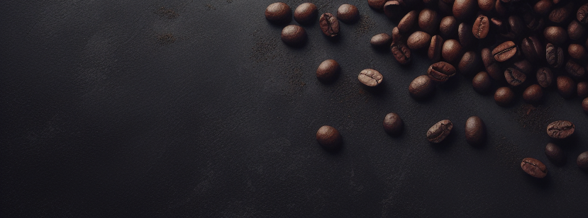

# Dev-Coffe

☕ Cafeteria do Dev

Uma landing page moderna e responsiva para uma cafeteria fictícia, com foco em design elegante, animações suaves e experiência do usuário.

🚀 Tecnologias Utilizadas

HTML5 – Estrutura semântica da página

CSS3 – Estilização responsiva e animações personalizadas

Google Fonts (Poppins & Pacifico) – Tipografia personalizada

AOS (Animate On Scroll) – Animações ao rolar a página

🎨 Funcionalidades

✅ Header fixo com menu de navegação

✅ Seção principal (Hero) com call-to-action "Café e Código"

✅ Cards de serviços com efeito hover animado

✅ Responsividade (funciona bem em desktop, tablet e mobile)

✅ Footer personalizado com créditos do portfólio

📱 Responsividade

Layout adaptado para desktops, tablets e smartphones.

Ajustes automáticos em fontes, imagens e grid.

💡 Inspiração

Este projeto foi desenvolvido como parte de um portfólio de front-end, unindo criatividade, design e código limpo.

📜 Licença

Este projeto é de uso livre para estudos e portfólio.
Créditos: Clube do Portfólio.

